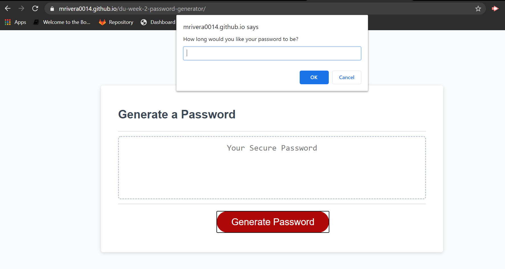
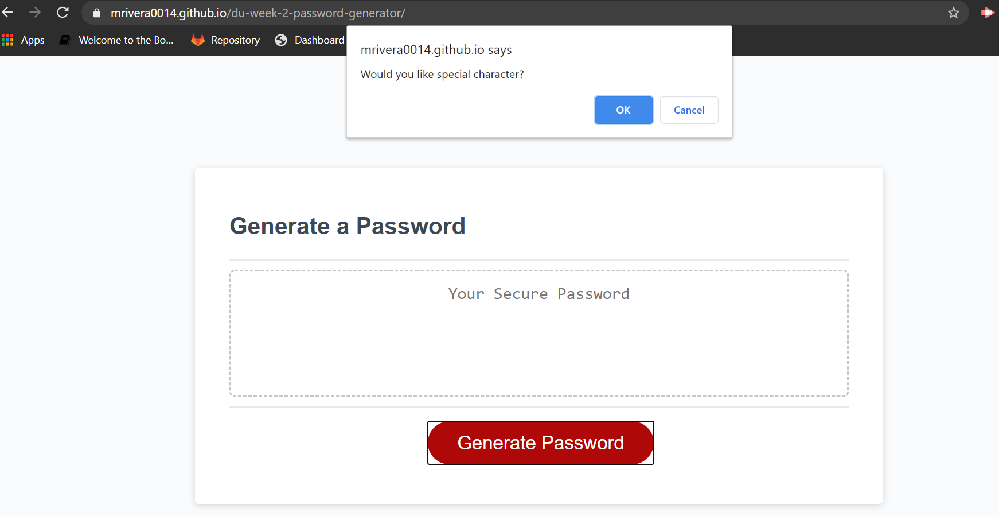

# du-week-2-password-generator

## Description
In this project I modified a starter code that allowed employees to generate random passcodes based on criteria that they selected. 

This application will be perfect for creating a secure password.

## Questions
If you have any questions contact me at mrivera0014@gmail.com.
Find more of my work at (https://github.com/mrivera0014/)

## Screenshots

## Links
[Link to Github repository](https://github.com/mrivera0014/du-week-2-password-generator)

[Link to Deployed application](https://mrivera0014.github.io/du-week-2-password-generator/)

